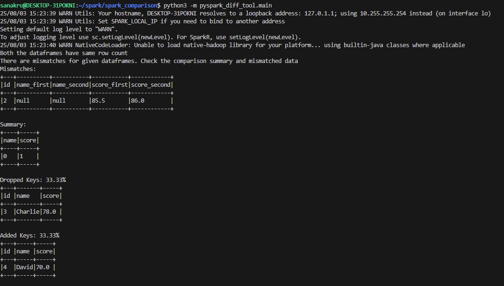

# DataFrame Comparison Utility (PySpark)

## Overview
This utility provides a structured way to compare two PySpark DataFrames and identify mismatches in row-level data and schema. It is especially useful for validating data migrations, ETL pipelines, or regression tests between different data sources.

---

## Features
- **Handles Schema Mismatches**: Automatically aligns schemas with `null`-filled missing columns.
- **Row Count Validation**: Checks if row counts match.
- **Key Column Check**: Ensures provided key is unique in both DataFrames.
- **Support for Threshold on Numeric Columns**: Allows approximate equality for float/double values.
- **Drop/Add Key Coverage**: Identifies newly added or removed rows based on the key.
- **Optional Filtering to Common Keys Only**
- **Works with Struct and Array Columns**

---

## Installation
Ensure you have PySpark installed in your environment:
```bash
pip install pyspark
```

---

## Usage
```python
from compare_module import compare_dataframes  # Assuming the file is named compare_module.py

# df_1 and df_2 are two PySpark DataFrames to compare
key = "id"  # Common unique key column
threshold = 0.01  # Optional threshold for numeric comparison
local_test_cases = False  # Optional: Whether to filter only common keys

mismatched_df, summary_df, drop_coverage, add_coverage = compare_dataframes(df_1, df_2, key, threshold, local_test_cases)
```

---

## Function Reference
### `compare_dataframes(df_1, df_2, key, threshold=None, local_test_cases=False)`
| Parameter        | Type     | Description |
|------------------|----------|-------------|
| `df_1`           | DataFrame| First input DataFrame |
| `df_2`           | DataFrame| Second input DataFrame |
| `key`            | str      | Unique identifier column for comparison |
| `threshold`      | float    | Optional tolerance for numeric values |
| `local_test_cases` | bool   | If `True`, filters both DataFrames to only common keys |

**Returns:**
- `mismatched_df`: DataFrame with mismatched column values
- `summary_df`: DataFrame with mismatch counts per column
- `drop_coverage`: Tuple with % of dropped keys and corresponding rows
- `add_coverage`: Tuple with % of added keys and corresponding rows

---

## Logic Used for Column Comparison
**When comparing columns:**
- If values are equal → assign `NULL`
- If values differ → assign the original value

### Equality Rules:
- **Double type columns**:
  - If both values are **not null**, check if `|col1 - col2| < threshold`
- **Other data types**:
  - If values are not equal, mark as mismatch

---

## Example Output
```text
No mismatches found
-- or --
There are mismatches
```

The output includes:
- Detailed mismatch rows
- Summary of mismatches per column
- Percentage of rows dropped/added based on key comparison

---

## Notes
- Both DataFrames must contain the `key` column
- Ensure `key` is unique across each DataFrame for accurate comparisons
- Works with nested and struct fields

---

## Example
